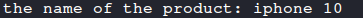
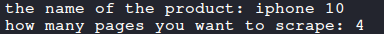
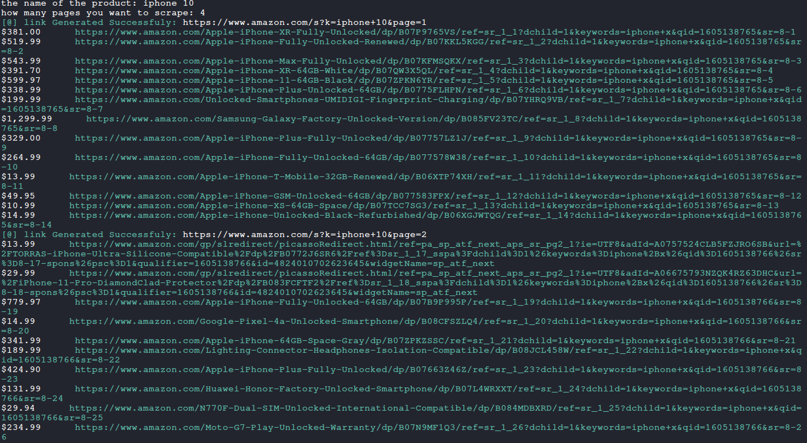

# Amazon-price-scraper
this script will help you to scrape prices of how many pages you want with no limit

# information about the script:-
- it's fully dynamic (not hard coded)
- you can choose the name of the product and how many pages you want to scrape 
- this script will not get blocked from amazon because it uses a fake-header (it will look like a human for the server)
- the script is fully commented if you want to edit on it and use it with ur website or anything else :)

# how it works :) ?
- run the script and type the product name:

- then choose how many pages you want to scrape:

- then you will get the output with the links!:

# before you go :)
- this is my discord if you need any help with the script or any thing else: 0xAPI48#5072
- please fork my project and give it a star this will help me to continue uploading projects <3 :)
